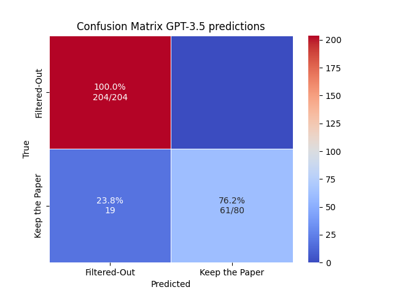
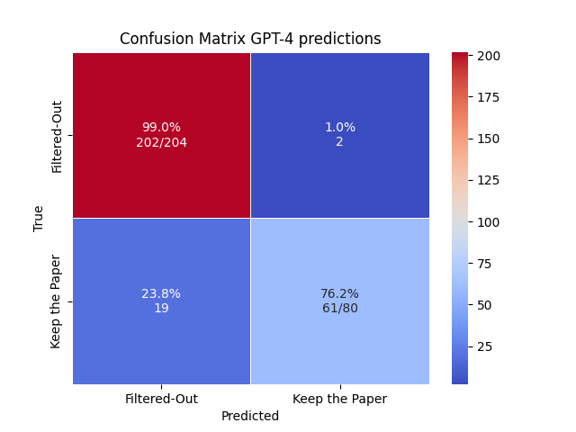
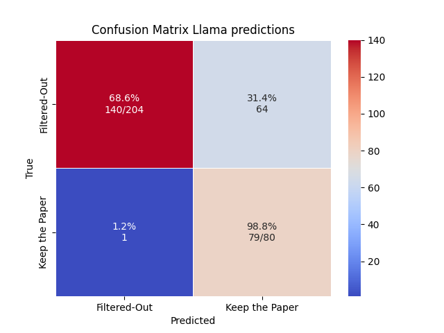

# 🤖 Time Series Modelling Scraper 📚

**Time Series Modelling Scraper** is an **innovative tool** designed to **automate** the process of **identifying and
filtering
academic papers** related to time series modelling from ArXiv. By employing a combination of keyword filtering and
binary
classification through a Language Model (LLM), this project caters to a broad range of fields, requiring only **minimal
adjustments** to the prompts for **seamless adaptation**.


## ♻️️ Reusability

The tool is designed to be easily adapted to various research areas. By modifying the configuration, users can customize
the scraper to their specific needs, making it a versatile solution for researchers across different domains. We also
provide a ready-to-use and straightforward implementation to switch LLMs, enabling both local and cloud-based LLMs.
For simplicity, this `README.md` is written in the context of time series modelling research.

## ✨ Features

- 🔍 **Arxiv Keyword Filters:** Utilizes specific keywords to sift through ArXiv submissions, ensuring relevance to time
  series modelling.
- 🧠 **Binary Classification with an LLM:** Further refines the selection by assessing the relevance of papers through a
  sophisticated language model, distinguishing with high accuracy.
- 🌐 **Flexible and Field-Agnostic:** Designed to be easily adapted to various research areas with minor modifications to
  the configuration (more below). Usable with local and cloud-based LLMs.
- ⏱️ **Automated Batch and Daily Scraping:** Offers scripts for one-time, iterative batch, and daily scraping to
  accommodate different user needs.


# 🚀 Getting Started

## 📋 Prerequisites

- Python version `3.8.10+`,
- An LLM to call, either locally or via an API key - for example from Mistral or from OpenAI.

## 🔧 Installation

1. Clone this repository to your local machine.
2. Install the required Python packages:

```bash
    pip install -r requirements.txt
```

3. If you desire to use an API, obtain an API key and set it up as an environment variable as outlined in
   the `Configuration` section below.

## 📜 Scripts Overview

- `scrape_once.py`: Executes a one-time scrape and filter operation.
- `scrape_once_iter.py`: Performs scraping and filtering in batches over a specified time period.
- `scrape_daily.py`: Intended for automated daily runs, fetching and processing the latest submissions.

## ⚙️ Configuration

Modify the following parameters in `config.py` to tailor the scraper to your specific needs:

- `MODEL_LLM`: Specifies the language model to use.
- `ENABLE_LLM_FILTER`: Toggles the usage of the LLM filter.
- `QUERY_ARXIV_DEEPINTOMLF`: Customizes the query for ArXiv for keyword matching.
- `PROMPT_LLM_DEEPINTOMLF`: Sets the instruction for the language model, followed by adding the abstract of the paper.

Also, add the API key as an environment variable and use it in the appropriate wrapper.

```bash
export API_KEY='YOUR_API_KEY'
```

By default, our implementation of the OpenAI wrapper uses the key called `OPENAI_API_KEY` and the Mistral wrapper uses `MISTRAL_API_KEY`.
An alternative is to use an `.env`file, see https://stackoverflow.com/questions/40216311/reading-in-environment-variables-from-an-environment-file.

## 🖥️ Usage

After setting up your environment and configuring the parameters, choose a script to run based on your requirements. For
example, to perform a one-time scrape and filter operation, execute:

```bash
    python scrape_once.py
```

Some logs should appear in the terminal and the file  `tsgen_papers_test.csv` should be created in the `data_scraped` folder.

## 📦 Scrape with a Different LLM

We wrote the class `Llm_wrapper` for the convenience of the user to switch between different LLMs.

To use an LLM, implement a custom wrapper following these steps:

- Inherit from the `Llm_wrapper` class and implement the query method within the new subclass.
- Update the `LLM_WRAPPER_CHOICE` parameter to reflect the new class name.
- Add the new wrapper class to the `REGISTERED_LLM_WRAPPERS` dictionary.
- Upon completion of these steps, the scraping scripts will automatically recognize and utilize the newly specified LLM.


# 📊 Benchmarking

## 💵 Costs and Performance: 93% accuracy, 100% precision

- We were able to get 93% of accuracy on our benchmark papers using GPT3.5 turbo.
- The cost of filtering **1000 papers** is **0.50$** - using the API from
  Mistral, `mistral-medium`: https://mistral.ai/technology/.
  One can easily compute the cost with this
  formula `NUMBER OF TOKENS PER PAPER` * `NUMBER OF PAPERS` * `COST PER TOKEN`.

## 🛠️ Testing and Maintenance (for Deep Into MLF)

For robustness and reliability, the project employs two CSV files for testing purposes:

- `not_matching_papers.csv` for papers expected to be filtered out.
- `matching_papers.csv` for papers expected to be identified as relevant.

These files are integral to ongoing testing and maintenance, ensuring the scraper's precision over time.
The tests are written inside `test_scrape.py`.

## 📈 Results

We benchmark models using the `benchmark_papers.csv` files. It is composed of 284 papers, among which 80 match our criteria and 204 do not. 
The results are as follows:


<p float="left">
  
  
  
</p>

# ❓ Troubleshooting

It is possible that if you apply our code to a different field, the filter need some work to get as good performances.
This includes tweaking the `QUERY_ARXIV_DEEPINTOMLF` and `PROMPT_LLM_DEEPINTOMLF` in the `config.py` file.
It did not represent a lot of time for us and we expect users to get reproducible results for other fields.

# 👥 Contribution

We welcome contributions from the community. If you'd like to contribute, please fork the repository, make your changes,
and submit a pull request. For major changes, please open an issue first to discuss what you would like to change.

We would like to thank the following people for their contributions to this project:

- **[@Code-Cornelius](https://github.com/Code-Cornelius)** - Main developer and contributor.
- **[@LeiJiang1](https://github.com/LeiJiang1)** - Provided valuable feedback and assistance.
- **[@hello0630](https://github.com/hello0630)** - Supervision and valuable feedback.
- **[@rahucl](https://github.com/rahucl)** - Assisted with the installation and configuration of the LLMs.
- **[@tjj0502](https://github.com/tjj0502)** - Original annotation of the benchmark dataset.